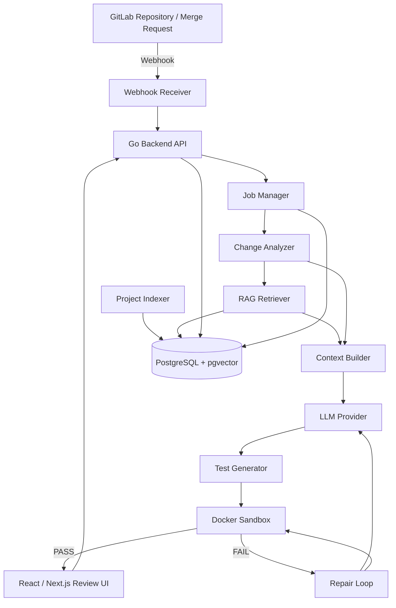

# AI Test Assistant - Technical Design and Development Roadmap

**Project type:** Graduation thesis / engineering project  
**Primary goal:** Use AI + project-aware RAG to recommend, generate, validate, repair, and review automation tests when source code changes.  
**Primary language for MVP:** Go  
**Primary Git provider:** GitLab  
**Document version:** 1.0  
**Intended readers:** Project team, mentor, Codex / coding agents, reviewers

---

## 1. Executive Summary

The system is an AI-assisted automation testing platform that integrates with GitLab. When a Merge Request changes source code, the platform detects the changed files and symbols, retrieves project-specific context through RAG, asks an LLM to recommend missing test cases and generate Go tests, validates the generated tests in an isolated Docker sandbox, optionally repairs failed generated tests for a limited number of attempts, and finally presents the result to a Developer or Tester for human review.

The core research and engineering pipeline is:

```text
Code Change
  -> Change Analysis
  -> Project Context / RAG
  -> Test Recommendation
  -> Test Generation
  -> Validation
  -> Repair
  -> Human Review
```

The system is an assistant, not an autonomous replacement for Developers, Testers, QA, or QC. Human review remains the final decision point.

---

## 2. Scope

### 2.1 MVP Scope

The first stable version MUST support:

- GitLab project connection.
- GitLab Merge Request webhook handling.
- Fetching MR metadata, commits, and diffs through GitLab API.
- Go source analysis.
- Detection of changed files and changed Go symbols.
- Indexing project source code, tests, and selected documentation.
- Project-isolated RAG retrieval using PostgreSQL + pgvector.
- AI test-case recommendation.
- AI generation of Go unit tests.
- Isolated compile/test execution inside Docker.
- Limited AI repair loop for generated tests that fail validation.
- Review UI showing change, context, recommendation, generated test, validation logs, and repair history.
- Human Accept / Reject decision.
- Basic evaluation metrics.

### 2.2 Explicitly Out of MVP

Do NOT include the following until the MVP is complete:

- Multi-language source analysis.
- GitHub / Bitbucket integration.
- Automatic merge of generated code.
- Release risk scoring.
- Log Root Cause Analysis.
- Autonomous production changes.
- Large-scale Kubernetes deployment.
- Complex event-driven microservice decomposition of the AI Test Assistant itself.
- Mutation testing as a mandatory feature.

### 2.3 Architecture Decision

The AI Test Assistant SHOULD be implemented as a **modular monolith with a separate background worker**, not as many independent microservices.

Recommended deployable components:

```text
1. backend-api      - Go HTTP API and webhook receiver
2. backend-worker   - asynchronous analysis/generation/validation jobs
3. frontend         - React / Next.js
4. postgres         - metadata + pgvector
5. sandbox-runtime  - ephemeral Docker containers created by worker
```

The project being analyzed may itself be a microservices project. The analysis platform does not need to be microservices during the thesis MVP.

---

## 3. Success Criteria

The project is considered functionally complete when the following end-to-end demo works:

```text
1. Developer creates or updates a Merge Request in GitLab.
2. GitLab sends a webhook to AI Test Assistant.
3. The system creates an analysis job.
4. The system fetches the MR diff through GitLab API.
5. The Go analyzer detects changed functions/methods/types.
6. RAG retrieves related implementation, interfaces, mocks, tests, and docs.
7. AI recommends missing test cases.
8. AI generates one or more Go tests.
9. The generated test is inserted into an isolated temporary workspace.
10. Docker sandbox runs go test.
11. If validation fails, AI may repair the generated test up to MAX_REPAIR_ATTEMPTS.
12. The UI displays all artifacts and history.
13. Developer/Tester accepts or rejects the generated test.
```

Minimum quality metrics to report:

- Compile success rate.
- Test execution success rate.
- First-pass success rate.
- Repair success rate.
- Final success rate after repair.
- Coverage delta.
- Human acceptance rate.
- Average processing time.
- Manual test-writing time vs AI-assisted review time for selected scenarios.

---

## 4. High-Level Architecture



### 4.1 Main Responsibilities

| Module | Responsibility |
|---|---|
| GitLab Integration | Receive webhook, call API, fetch MR/diff/repository data |
| Change Analyzer | Detect changed files and Go symbols |
| Project Indexer | Parse project files into retrievable knowledge chunks |
| RAG Retriever | Retrieve project-specific context for a code change |
| Context Builder | Build compact, structured LLM context |
| Recommendation Engine | Ask AI which test cases are missing |
| Test Generator | Generate Go automation tests |
| Sandbox | Compile/run generated tests safely |
| Repair Engine | Repair generated tests based on compiler/test errors |
| Review Module | Present history and store human decision |
| Evaluation Module | Calculate experiment metrics |

---

## 5. End-to-End Processing Flow

### 5.1 Trigger Flow

```text
GitLab MR event
  -> POST /api/webhooks/gitlab
  -> verify webhook secret
  -> extract project_id + merge_request_iid
  -> create analysis_job
  -> enqueue job
  -> return HTTP 202 quickly
```

The webhook handler SHOULD NOT perform the complete AI workflow synchronously.

### 5.2 Analysis Flow

```text
analysis_job
  -> fetch MR details
  -> fetch diff
  -> filter supported files
  -> checkout/fetch repository snapshot
  -> parse Go source
  -> map diff lines to symbols
  -> persist changed_files / changed_symbols
```

### 5.3 RAG Flow

```text
changed symbol
  -> find same package
  -> find direct interfaces / structs / methods
  -> find existing *_test.go files
  -> find mocks and fixtures
  -> vector similarity search
  -> rank / deduplicate
  -> enforce project_id isolation
  -> build compact context package
```

### 5.4 AI Flow

```text
structured change context
  -> recommend missing test cases
  -> human-readable recommendation records
  -> generate candidate test code
  -> save generated artifact
```

### 5.5 Validation and Repair Flow

```text
generated test
  -> create temporary workspace
  -> copy repository snapshot
  -> add generated test
  -> run isolated Docker container
  -> go test ./...
      PASS -> WAITING_REVIEW
      FAIL -> collect stdout/stderr
           -> if attempts < MAX_REPAIR_ATTEMPTS
                -> AI repair
                -> rerun
              else
                -> WAITING_REVIEW with failed status
```

---

## 6. Repository Structure

Recommended repository layout:

```text
ai-test-assistant/
|
|-- backend/
|   |-- cmd/
|   |   |-- api/
|   |   |   `-- main.go
|   |   `-- worker/
|   |       `-- main.go
|   |
|   |-- internal/
|   |   |-- config/
|   |   |   `-- config.go
|   |   |
|   |   |-- project/
|   |   |   |-- model.go
|   |   |   |-- service.go
|   |   |   `-- repository.go
|   |   |
|   |   |-- gitlab/
|   |   |   |-- client.go
|   |   |   |-- webhook.go
|   |   |   |-- merge_request.go
|   |   |   |-- diff.go
|   |   |   `-- repository.go
|   |   |
|   |   |-- analyzer/
|   |   |   |-- analyzer.go
|   |   |   |-- change_analyzer.go
|   |   |   |-- go_parser.go
|   |   |   |-- symbol.go
|   |   |   `-- dependency_analyzer.go
|   |   |
|   |   |-- knowledge/
|   |   |   |-- model.go
|   |   |   |-- indexer.go
|   |   |   |-- chunker.go
|   |   |   |-- embedding.go
|   |   |   |-- retriever.go
|   |   |   `-- ranking.go
|   |   |
|   |   |-- llm/
|   |   |   |-- provider.go
|   |   |   |-- client.go
|   |   |   |-- recommendation.go
|   |   |   |-- generation.go
|   |   |   `-- repair.go
|   |   |
|   |   |-- prompt/
|   |   |   |-- context_builder.go
|   |   |   `-- renderer.go
|   |   |
|   |   |-- sandbox/
|   |   |   |-- runner.go
|   |   |   |-- docker_runner.go
|   |   |   |-- workspace.go
|   |   |   `-- limits.go
|   |   |
|   |   |-- validation/
|   |   |   |-- model.go
|   |   |   `-- service.go
|   |   |
|   |   |-- repair/
|   |   |   `-- service.go
|   |   |
|   |   |-- review/
|   |   |   |-- model.go
|   |   |   `-- service.go
|   |   |
|   |   |-- job/
|   |   |   |-- model.go
|   |   |   |-- queue.go
|   |   |   `-- worker.go
|   |   |
|   |   |-- evaluation/
|   |   |   `-- metrics.go
|   |   |
|   |   `-- storage/
|   |       |-- postgres.go
|   |       `-- transaction.go
|   |
|   |-- migrations/
|   |   |-- 000001_init.up.sql
|   |   `-- 000001_init.down.sql
|   |
|   |-- prompts/
|   |   |-- recommend_test.md
|   |   |-- generate_test.md
|   |   `-- repair_test.md
|   |
|   |-- go.mod
|   `-- go.sum
|
|-- frontend/
|   |-- app/
|   |   |-- projects/
|   |   |-- analyses/
|   |   `-- settings/
|   |-- components/
|   |-- lib/
|   |-- services/
|   |-- types/
|   `-- package.json
|
|-- infra/
|   |-- docker/
|   |   |-- Dockerfile.api
|   |   |-- Dockerfile.worker
|   |   |-- Dockerfile.frontend
|   |   `-- Dockerfile.sandbox-go
|   |-- compose/
|   |   `-- docker-compose.yml
|   `-- kubernetes/                 # optional after MVP
|
|-- examples/
|   `-- go-microservices/
|       |-- user-service/
|       |-- order-service/
|       `-- product-service/
|
|-- scripts/
|   |-- dev-up.sh
|   |-- dev-down.sh
|   |-- migrate.sh
|   `-- seed.sh
|
|-- docs/
|   |-- architecture.md
|   |-- api.md
|   |-- database.md
|   |-- rag-design.md
|   |-- sandbox-security.md
|   |-- evaluation.md
|   `-- thesis-notes.md
|
|-- .gitlab-ci.yml
|-- .env.example
|-- Makefile
|-- README.md
`-- LICENSE
```

### 6.1 Repository Rules for Codex / Coding Agents

- Do not create new top-level folders without a clear reason.
- Keep business logic inside `backend/internal`.
- Keep `cmd/api` and `cmd/worker` thin; only bootstrap dependencies there.
- No direct database calls from HTTP handlers.
- No direct LLM calls from HTTP handlers.
- No direct Docker execution from HTTP handlers.
- Every external integration MUST be behind an interface.
- Add unit tests near the package being implemented.
- Update migrations for persistent model changes.
- Update API docs when endpoints change.
- Never commit `.env`, tokens, GitLab secrets, or LLM keys.

---

## 7. Core Domain Model

### 7.1 Main Entities

```text
User
Project
GitLabConnection
AnalysisJob
ChangeSet
ChangedFile
ChangedSymbol
KnowledgeDocument
KnowledgeChunk
TestRecommendation
TestGeneration
GeneratedTest
ValidationRun
RepairAttempt
Review
```

### 7.2 Suggested Relationships

```text
Project
  |-- GitLabConnection
  |-- KnowledgeDocument
  |     `-- KnowledgeChunk
  |
  `-- AnalysisJob
        |-- ChangeSet
        |     |-- ChangedFile
        |     `-- ChangedSymbol
        |
        |-- TestRecommendation
        `-- TestGeneration
              |-- GeneratedTest
              |     `-- ValidationRun
              |           `-- RepairAttempt
              `-- Review
```

### 7.3 Minimum Database Tables

#### projects

```text
id
name
gitlab_project_id
repository_url
default_branch
language
status
created_at
updated_at
```

#### gitlab_connections

```text
id
project_id
base_url
token_encrypted
webhook_secret_hash
created_at
updated_at
```

#### analysis_jobs

```text
id
project_id
merge_request_iid
source_sha
target_sha
status
error_message
started_at
finished_at
created_at
```

#### changed_files

```text
id
analysis_job_id
file_path
change_type
old_path
new_path
additions
deletions
```

#### changed_symbols

```text
id
changed_file_id
symbol_name
symbol_kind
package_name
start_line
end_line
change_summary
```

#### knowledge_chunks

```text
id
project_id
file_path
package_name
symbol_name
chunk_type
content
content_hash
start_line
end_line
embedding VECTOR(...)
metadata JSONB
created_at
updated_at
```

#### test_recommendations

```text
id
analysis_job_id
changed_symbol_id
title
description
priority
rationale
status
created_at
```

#### generated_tests

```text
id
analysis_job_id
recommendation_id
file_path
code
model_name
prompt_version
generation_attempt
created_at
```

#### validation_runs

```text
id
generated_test_id
attempt_number
command
exit_code
stdout
stderr
duration_ms
status
created_at
```

#### repair_attempts

```text
id
generated_test_id
validation_run_id
attempt_number
previous_code
repaired_code
model_name
reason
created_at
```

#### reviews

```text
id
generated_test_id
reviewer_id
decision
comment
created_at
```

---

## 8. Analysis Job State Machine

Recommended states:

```text
PENDING
  -> FETCHING_SOURCE
  -> ANALYZING_CHANGE
  -> RETRIEVING_CONTEXT
  -> RECOMMENDING_TESTS
  -> GENERATING_TESTS
  -> VALIDATING
  -> REPAIRING
  -> WAITING_REVIEW
  -> ACCEPTED / REJECTED
```

Error state:

```text
FAILED
```

Rules:

- Every state transition MUST be persisted.
- Worker retries infrastructure failures separately from AI repair attempts.
- AI repair attempt count MUST NOT be confused with job retry count.
- A failed validation can still reach `WAITING_REVIEW` after the repair limit is exhausted.
- Accept/Reject is a human action, not an LLM decision.

---

## 9. API Design

### 9.1 Project APIs

```text
POST   /api/projects
GET    /api/projects
GET    /api/projects/:id
PATCH  /api/projects/:id
DELETE /api/projects/:id

POST   /api/projects/:id/test-connection
POST   /api/projects/:id/index
GET    /api/projects/:id/index/status
```

### 9.2 GitLab Webhook

```text
POST /api/webhooks/gitlab
```

Responsibilities:

- Verify shared secret.
- Validate supported GitLab event.
- Extract project and MR identifiers.
- De-duplicate repeated events.
- Create/enqueue analysis job.
- Return quickly.

### 9.3 Analysis APIs

```text
GET /api/analyses
GET /api/analyses/:id
GET /api/analyses/:id/changes
GET /api/analyses/:id/context
GET /api/analyses/:id/recommendations
GET /api/analyses/:id/generated-tests
GET /api/analyses/:id/validations
GET /api/analyses/:id/repairs
```

### 9.4 Review APIs

```text
POST /api/generated-tests/:id/accept
POST /api/generated-tests/:id/reject
```

Example accept body:

```json
{
  "comment": "Test covers the new duplicate-email validation and follows project convention."
}
```

---

## 10. Go Source Analysis Design

### 10.1 Goal

Convert a raw Git diff into structured semantic information suitable for retrieval and AI reasoning.

### 10.2 Use Go AST

Recommended standard packages:

```text
go/parser
go/ast
go/token
go/types      # optional in later refinement
go/packages   # optional in later refinement
```

### 10.3 Symbol Types to Detect

- Function.
- Method.
- Struct.
- Interface.
- Type declaration.
- Constant/variable group when relevant.
- Test function.

### 10.4 Diff-to-Symbol Mapping

For each changed file:

```text
1. Parse old/new diff ranges.
2. Parse the new version of the Go file.
3. Record symbol start/end line ranges.
4. Intersect changed line ranges with symbol ranges.
5. Mark overlapping symbols as changed.
6. Persist symbol metadata.
```

### 10.5 Example Analyzer Output

```json
{
  "file": "internal/user/service.go",
  "package": "user",
  "symbol": "CreateUser",
  "kind": "method",
  "start_line": 42,
  "end_line": 88,
  "change_summary": "Added duplicate email validation before repository create"
}
```

### 10.6 Analyzer DoD

- Correctly detects changed Go files.
- Correctly maps changed lines to at least functions/methods.
- Existing unit tests cover parsing and diff mapping.
- Unsupported files are skipped without failing the complete job.

---

## 11. Project Knowledge and RAG Design

### 11.1 RAG Goal

The RAG layer MUST provide relevant project context without sending the entire repository to the LLM.

### 11.2 Data Sources to Index

MVP priority order:

1. Go implementation files.
2. Go test files.
3. Interfaces.
4. Mocks / fixtures / test helpers.
5. README and selected project documentation.
6. Optional API specifications.

Files that MUST be excluded:

```text
.env
*.pem
*.key
private keys
secret files
vendor/
.git/
node_modules/
binary files
large generated files
```

### 11.3 Semantic Chunking

Prefer symbol-aware chunks over fixed token windows.

Example chunk:

```json
{
  "project_id": 12,
  "file_path": "internal/user/service.go",
  "package_name": "user",
  "chunk_type": "function",
  "symbol_name": "CreateUser",
  "start_line": 42,
  "end_line": 88,
  "content": "func (s *Service) CreateUser(...) ..."
}
```

### 11.4 Retrieval Strategy

Do NOT rely only on vector similarity.

Recommended hybrid retrieval signals:

```text
- same project_id                 REQUIRED
- same package                    high weight
- exact symbol name               high weight
- referenced interface/type       high weight
- related *_test.go               high weight
- mock/helper naming              medium weight
- file path similarity            medium weight
- vector similarity               medium/high weight
- documentation relevance         medium weight
```

Conceptual scoring:

```text
final_score = structural_score + semantic_score + test_relevance_score
```

Exact weights should be configurable and evaluated experimentally.

### 11.5 Context Package

The Context Builder SHOULD output a deterministic structure similar to:

```text
PROJECT
- name
- language
- test framework conventions

CHANGE
- MR id
- changed file
- changed symbol
- compact diff

TARGET IMPLEMENTATION
- current function/method body

RELATED TYPES / INTERFACES
- direct dependencies

EXISTING TESTS
- closest existing tests

MOCKS / FIXTURES
- relevant helpers

PROJECT CONVENTIONS
- package naming
- assertion library
- mocking style
- table-driven test patterns

RELEVANT DOCS
- only retrieved snippets

TASK
- recommend missing test cases
```

### 11.6 RAG DoD

Given a changed function such as `CreateUser`, retrieval SHOULD return the implementation plus most of the following when they exist:

- Existing `CreateUser` tests.
- Repository/interface used by `CreateUser`.
- Relevant mock.
- Related DTO/model.
- Relevant business-rule documentation.

---

## 12. LLM Abstraction

### 12.1 Provider Interface

The codebase SHOULD isolate LLM vendor details.

```go
type Provider interface {
    Generate(ctx context.Context, req Request) (Response, error)
}
```

MVP can implement only one provider. Additional providers are optional.

### 12.2 Separate AI Tasks

Do not use one giant prompt for the complete workflow.

Use separate tasks:

```text
1. RecommendTests
2. GenerateTest
3. RepairTest
```

Each task MUST have a versioned prompt template.

### 12.3 Structured Output

Recommendation response SHOULD use validated JSON.

Example:

```json
{
  "recommendations": [
    {
      "title": "Duplicate email",
      "priority": "high",
      "rationale": "A new duplicate-email branch was added without an existing test.",
      "scenario": "Repository lookup reports an existing user with the same email.",
      "expected": "CreateUser returns ErrEmailExists and does not call Create."
    }
  ]
}
```

Generation response SHOULD contain generated test file metadata plus code.

### 12.4 Prompt Safety Rules

Prompts MUST tell the model:

- Only change generated test code during repair.
- Do not modify production code to make a test pass.
- Follow the retrieved project conventions.
- Do not invent unavailable APIs when interfaces are provided.
- Do not expose secrets.
- Return structured output when required.

---

## 13. Docker Sandbox Design

### 13.1 Principle

Never execute generated code directly inside the backend API or worker host process.

### 13.2 Runtime Flow

```text
Repository snapshot
  -> temporary workspace
  -> generated test inserted
  -> ephemeral Docker container
  -> go test ./...
  -> capture exit code/stdout/stderr/duration
  -> destroy container/workspace
```

### 13.3 Minimum Isolation

The sandbox SHOULD enforce:

```text
network disabled by default
CPU limit
memory limit
PID limit
execution timeout
non-root user
read-only base filesystem where practical
temporary writable workspace
no Docker socket mounted inside sandbox
no host secrets mounted
```

### 13.4 Initial Validation Command

```bash
go test ./...
```

Optional later refinement:

```bash
go test -race ./...
go test -coverprofile=coverage.out ./...
```

### 13.5 Sandbox Result

```json
{
  "status": "failed",
  "exit_code": 1,
  "duration_ms": 2140,
  "stdout": "...",
  "stderr": "..."
}
```

---

## 14. Repair Loop

### 14.1 Rules

Recommended default:

```text
MAX_REPAIR_ATTEMPTS = 2
```

Hard maximum for thesis demo:

```text
MAX_REPAIR_ATTEMPTS <= 3
```

Repair input SHOULD include:

- Generated test.
- Compiler/test error.
- Target interfaces and signatures.
- Minimal related implementation context.
- Existing test conventions.

Repair instruction MUST explicitly say:

```text
Fix only the generated test.
Do not modify production code.
Do not remove meaningful assertions just to make the test pass.
```

### 14.2 Repair DoD

- Failed validation output is persisted.
- Repair attempts are versioned.
- Every repaired version is auditable.
- The loop always terminates.
- Final failed results can still be reviewed by a human.

---

## 15. Frontend Design

### 15.1 Required Screens

#### Projects

Display:

- Connected GitLab projects.
- Index status.
- Last analysis status.

#### Project Detail

Display/configure:

- GitLab connection.
- Branch.
- Language.
- Index statistics.
- Re-index action.

#### Analysis Jobs

Display:

- Merge Request.
- Commit SHA.
- Status.
- Created time.
- Result summary.

#### Analysis Detail

Display:

- MR metadata.
- Changed files.
- Changed symbols.
- Retrieved context.
- Recommendations.

#### Generated Test Review

Display:

```text
Changed code
Recommended scenario
Generated test code
Validation attempt 1
Repair attempt 1
Validation attempt 2
Final status
Accept / Reject
Reviewer comment
```

### 15.2 UI Priority

The Review screen is the most important demo screen. UI polish is secondary to traceability and clarity.

---

## 16. Security Requirements

### 16.1 Secret Handling

Never send the following to an external AI provider:

- `.env` content.
- Access tokens.
- Passwords.
- Private keys.
- Connection strings containing credentials.

### 16.2 Context Sanitization Pipeline

```text
Repository content
  -> file exclusion
  -> secret pattern scan
  -> RAG retrieval
  -> context minimization
  -> final sensitive-data mask
  -> LLM
```

### 16.3 Project Isolation

Every knowledge query MUST include project ownership/isolation.

Conceptual SQL rule:

```sql
SELECT ...
FROM knowledge_chunks
WHERE project_id = $1
ORDER BY embedding <=> $2
LIMIT $3;
```

Never perform cross-project retrieval unless explicitly designed and authorized later.

### 16.4 GitLab Token Handling

- Store token encrypted at rest where practical.
- Never return tokens through API responses.
- Never print tokens in application logs.
- Mask request headers in debug logging.

---

## 17. Observability

Minimum structured log fields:

```text
request_id
analysis_job_id
project_id
merge_request_iid
phase
status
duration_ms
error_type
```

Recommended metrics:

```text
analysis_jobs_total
analysis_jobs_failed_total
analysis_duration_seconds
rag_retrieval_duration_seconds
llm_requests_total
llm_request_duration_seconds
validation_runs_total
repair_attempts_total
```

Full Prometheus/Grafana integration is optional for MVP; structured logs and database timestamps are sufficient for initial evaluation.

---

# 18. Development Phases

The following phases are intentionally sequential. Codex or developers SHOULD complete the Definition of Done for the current phase before implementing major features from later phases.

---

## Phase 0 - Scope Freeze, Sample Project, and Engineering Baseline

### Objective

Create a stable development target and remove ambiguity before AI development begins.

### Tasks

- Confirm MVP scope from Section 2.
- Create the `ai-test-assistant` repository.
- Create a small Go sample project that contains realistic services, repositories, interfaces, mocks, and tests.
- Recommended sample domain:
  - user-service
  - order-service
  - product-service
- Create several planned change scenarios for later experiments.
- Add README and architecture documents.
- Define coding conventions.
- Define branch strategy.
- Define `.env.example` without secrets.

### Suggested Sample Scenarios

1. Add duplicate email validation.
2. Add maximum order quantity rule.
3. Add product stock validation.
4. Change repository error handling.
5. Add a new boundary condition to a calculation.

### Deliverables

```text
repository skeleton
README.md
sample Go project
initial architecture.md
.env.example
Makefile
```

### DoD

- New developer can clone and run the sample project.
- Existing sample tests pass.
- Project structure is committed.
- MVP scope is documented.

### Do Not Do Yet

- LLM integration.
- pgvector retrieval.
- repair loop.
- Kubernetes.

---

## Phase 1 - Backend Foundation and Database

### Objective

Build the minimum backend platform for later phases.

### Tasks

- Implement Go API bootstrap.
- Implement configuration loader.
- Add PostgreSQL connection.
- Add migrations.
- Create initial entities:
  - Project
  - GitLabConnection
  - AnalysisJob
- Add health/readiness endpoints.
- Add repository/service separation.
- Add Docker Compose for local development.

### Minimum Endpoints

```text
GET  /health
GET  /ready
POST /api/projects
GET  /api/projects
GET  /api/projects/:id
```

### Tests

- Configuration parsing tests.
- Project service unit tests.
- Database integration smoke test.
- Health endpoint test.

### DoD

```text
docker compose up
```

starts backend + PostgreSQL and allows project CRUD through API.

### Do Not Do Yet

- Analyze code.
- Call AI.
- Generate embeddings.

---

## Phase 2 - GitLab Integration

### Objective

Receive Merge Request events and fetch authoritative change data from GitLab.

### Tasks

- Implement GitLab API client abstraction.
- Implement token configuration.
- Implement webhook secret verification.
- Handle MR create/update events.
- Fetch MR metadata.
- Fetch MR diff.
- Persist analysis job.
- De-duplicate duplicate webhook deliveries.
- Add local/manual trigger endpoint for development if useful.

### Core Interfaces

```go
type GitLabClient interface {
    GetMergeRequest(ctx context.Context, projectID int64, iid int64) (MergeRequest, error)
    GetMergeRequestDiff(ctx context.Context, projectID int64, iid int64) ([]FileDiff, error)
}
```

### DoD

A real GitLab MR event produces an `analysis_job` containing:

```text
project
MR IID
source SHA
target SHA
changed file list
raw/normalized diff metadata
```

### Tests

- Webhook signature/secret test.
- Unsupported event test.
- Duplicate event test.
- GitLab client mocked unit test.

### Do Not Do Yet

- Ask AI to interpret raw webhook payload.
- Depend on webhook payload alone for repository truth.

---

## Phase 3 - Go Change Analyzer

### Objective

Convert Git diff into semantic Go change information.

### Tasks

- Implement Go parser package.
- Parse functions, methods, structs, interfaces, tests.
- Implement changed-line range parser.
- Map changed line ranges to symbols.
- Persist `changed_files` and `changed_symbols`.
- Add compact deterministic change summary metadata.

### Example Output

```text
File: internal/user/service.go
Package: user
Symbol: CreateUser
Kind: method
Change: lines 55-63 overlap method body
```

### DoD

For test fixtures covering multiple diff patterns, the analyzer detects expected changed functions/methods reliably.

### Tests

Create fixtures for:

- Changed function body.
- New function.
- Deleted function.
- Changed method.
- Multi-symbol file.
- Test-only change.
- Non-Go file.

### Do Not Do Yet

- Use LLM to replace AST parsing.

---

## Phase 4 - Project Knowledge Index and RAG

### Objective

Build project-aware retrievable context.

### Tasks

- Enable pgvector extension.
- Implement `knowledge_chunks` migration.
- Build Go semantic chunker.
- Index implementation files.
- Index test files.
- Index selected docs.
- Implement embedding client abstraction.
- Implement re-index/update-by-content-hash.
- Implement hybrid retrieval.
- Enforce `project_id` filtering.

### Initial Retrieval API

```text
POST /api/projects/:id/index
GET  /api/projects/:id/index/status
```

Internal method example:

```go
RetrieveContext(ctx context.Context, query RetrievalQuery) ([]KnowledgeChunk, error)
```

### Evaluation Fixture

For a changed `CreateUser`, manually define the expected relevant files/symbols and compare retrieval output.

### DoD

The system retrieves project-specific implementation, test, interface, and mock context for known sample changes.

### Tests

- Chunker tests.
- Project isolation test.
- Content hash update test.
- Retrieval ranking fixture test.

### Do Not Do Yet

- Send the whole repository to the LLM.

---

## Phase 5 - AI Test Recommendation

### Objective

Use structured change + RAG context to propose meaningful missing test scenarios.

### Tasks

- Implement LLM Provider interface.
- Implement one real provider.
- Add `recommend_test.md` prompt.
- Define JSON response schema.
- Validate model output.
- Store recommendations.
- Expose recommendation API.

### Recommendation Input

```text
changed symbol
compact diff
implementation
interfaces/dependencies
existing tests
mocks/helpers
conventions
relevant docs
```

### DoD

For each selected sample MR, the system returns at least one structured recommendation and stores rationale and expected behavior.

### Tests

- Prompt renderer test.
- JSON schema validation test.
- Malformed provider output test.
- Mock provider unit tests.

### Quality Check

Human reviewer labels recommendations as:

```text
useful
partially useful
not useful
```

---

## Phase 6 - AI Test Generation

### Objective

Generate Go tests that follow project conventions and target selected recommendations.

### Tasks

- Add `generate_test.md` prompt.
- Include exact relevant interfaces/signatures.
- Include closest existing test examples.
- Generate candidate `_test.go` content.
- Store code with prompt/model metadata.
- Do syntax pre-check before sandbox execution when practical.

### Output Contract

```json
{
  "target_file": "internal/user/service_generated_test.go",
  "test_names": ["TestService_CreateUser_DuplicateEmail"],
  "code": "package user_test..."
}
```

### DoD

Generated code is stored, traceable to recommendation and analysis job, and ready for validation.

### Tests

- Structured output parser test.
- Empty code rejection.
- Invalid target path rejection.

### Do Not Do Yet

- Automatically commit generated tests to repository.

---

## Phase 7 - Docker Test Validation

### Objective

Prove whether generated tests compile and execute in an isolated environment.

### Tasks

- Build Go sandbox image.
- Implement workspace manager.
- Implement Docker runner abstraction.
- Disable network by default.
- Apply CPU/memory/PID/time limits.
- Run `go test ./...`.
- Capture stdout/stderr/exit code/duration.
- Persist validation runs.

### DoD

The platform can validate both a known passing generated test and a deliberately broken generated test without executing test code in the API process.

### Tests

- Passing sandbox test.
- Compiler failure test.
- Test assertion failure test.
- Timeout test.
- Resource-limit smoke test.

---

## Phase 8 - AI Repair Loop

### Objective

Repair invalid generated tests using validation feedback while guaranteeing termination.

### Tasks

- Add `repair_test.md` prompt.
- Implement max attempt configuration.
- Include compiler/test error in repair context.
- Keep production code immutable.
- Store each repaired version.
- Re-run sandbox after repair.
- Stop on pass or maximum attempts.

### State Example

```text
VALIDATING
  -> FAIL
  -> REPAIRING attempt 1
  -> VALIDATING
  -> FAIL
  -> REPAIRING attempt 2
  -> VALIDATING
  -> PASS
  -> WAITING_REVIEW
```

### DoD

At least one controlled experiment demonstrates:

```text
initial generated test = fail
repair attempt = changed generated test
final validation = pass
```

and one experiment demonstrates safe termination after maximum attempts.

---

## Phase 9 - Human Review UI

### Objective

Make the complete workflow inspectable and reviewable.

### Tasks

- Implement project list/detail.
- Implement analysis list/detail.
- Show changed files/symbols.
- Show retrieved context with source path.
- Show recommendation rationale.
- Show generated test with formatting.
- Show each validation run.
- Show repair history.
- Implement Accept / Reject.
- Implement reviewer comment.

### DoD

A reviewer can understand why a test was suggested, inspect the generated code and validation evidence, and save a final human decision.

### UX Rule

Do not hide failed attempts. Traceability is part of the thesis value.

---

## Phase 10 - Evaluation and Thesis Experiments

### Objective

Demonstrate measurable value rather than only a working demo.

### Experiment A - Context Impact

Compare:

```text
A1: Diff only -> LLM
A2: Diff + Project RAG -> LLM
```

Measure:

- Compile success.
- Test pass rate.
- Human usefulness/acceptance.

### Experiment B - Repair Impact

Compare:

```text
B1: Generate only
B2: Generate -> Validate -> Repair
```

Measure:

- First-pass success rate.
- Repair success rate.
- Final success rate.

### Experiment C - Human Effort

Compare selected tasks:

```text
manual test writing time
vs
AI-assisted generation + review time
```

### Additional Metric

Coverage delta:

```text
coverage_after - coverage_before
```

### Important Interpretation Rule

A passing test is not automatically a good test.

Evaluation SHOULD separate:

```text
syntactic validity
compile validity
execution validity
coverage contribution
human acceptance
```

### DoD

Produce reproducible experiment data and charts/tables for the thesis report.

---

## Phase 11 - Deployment, CI/CD, and Hardening

### Objective

Create a repeatable stable deployment after the core workflow is proven.

### Tasks

- Production Dockerfiles.
- Docker Compose deployment.
- GitLab CI pipeline.
- Lint/test/build stages.
- Migration execution strategy.
- Secret injection strategy.
- Backup strategy for PostgreSQL.
- Application logs.
- Security review of sandbox.
- Basic rate limiting / request validation.

### Suggested CI Pipeline

```text
lint
  -> unit-test
  -> integration-test
  -> build-backend
  -> build-frontend
  -> build-images
```

### DoD

A clean machine can deploy the platform using documented steps and the complete demo flow still works.

---

## Phase 12 - Optional Extensions

Only start this phase if Phases 0-11 are stable.

Possible extensions:

- Kubernetes deployment.
- GitLab comment/bot feedback on MR.
- Create a branch/MR containing accepted generated tests.
- Multi-language support.
- Multiple AI providers.
- More advanced dependency graph retrieval.
- Mutation testing.
- Release risk scoring.
- Log analysis / Root Cause Analysis.

These extensions MUST NOT reduce the quality of the core thesis experiment.

---

## 19. Suggested 12-Week Schedule

| Week | Main Work | Expected Result |
|---|---|---|
| 1 | Phase 0 | Scope, repo skeleton, sample Go project |
| 2 | Phase 1 | Go API + PostgreSQL + migrations |
| 3 | Phase 2 | GitLab MR webhook + diff |
| 4 | Phase 3 | Go changed-symbol analyzer |
| 5 | Phase 4A | Knowledge chunking + indexing |
| 6 | Phase 4B | Retrieval + RAG evaluation fixture |
| 7 | Phase 5 | AI recommendations |
| 8 | Phase 6 | AI test generation |
| 9 | Phase 7 | Docker validation |
| 10 | Phase 8 | Repair loop |
| 11 | Phase 9 | Review UI + end-to-end integration |
| 12 | Phase 10/11 | Experiments, metrics, CI/deployment, thesis evidence |

If the available duration is longer, spend extra time on evaluation quality, test coverage, and security rather than immediately expanding scope.

---

## 20. Milestone Gates

### Milestone M1 - GitLab Change Captured

Must show:

```text
MR -> webhook -> analysis_job -> changed files
```

### Milestone M2 - Semantic Change Understood

Must show:

```text
diff -> changed Go symbol
```

### Milestone M3 - Project Context Retrieved

Must show:

```text
changed symbol -> implementation + existing tests + dependencies + mocks/docs
```

### Milestone M4 - Test Recommended and Generated

Must show structured recommendation and generated Go test.

### Milestone M5 - Generated Test Validated

Must show sandbox evidence with stdout/stderr/exit code.

### Milestone M6 - Repair Demonstrated

Must show at least one fail -> repair -> pass flow.

### Milestone M7 - Human Review Demonstrated

Must show Accept/Reject with complete traceability.

### Milestone M8 - Experiment Completed

Must show quantitative comparison with reproducible sample changes.

---

## 21. Coding Standards for Codex

When Codex implements a phase, use the following rules.

### 21.1 Before Coding

Codex SHOULD:

1. Read this document.
2. Identify the current phase.
3. Inspect existing code before creating new modules.
4. Reuse existing interfaces and packages.
5. List files it intends to create/modify.
6. Avoid implementing future-phase features unless required as a minimal interface/stub.

### 21.2 During Coding

- Keep functions focused.
- Prefer explicit interfaces for GitLab, embeddings, LLM, sandbox, and persistence boundaries.
- Use `context.Context` for I/O operations.
- Return wrapped errors with meaningful context.
- Avoid global mutable state.
- Use structured logs.
- Validate external input.
- Keep secrets out of logs.
- Add unit tests with every core module.
- Prefer deterministic parsing/ranking logic before using AI.

### 21.3 After Coding

Codex SHOULD report:

```text
Implemented phase/subtask
Files created
Files modified
Database migration changes
API changes
Tests added
Commands to run tests
Known limitations
Next allowed phase/subtask
```

### 21.4 Definition of Complete Change

A code change is not complete if:

- It compiles but has no tests for core logic.
- It changes persistent data without migration.
- It changes API contract without docs.
- It adds a secret to source control.
- It bypasses project isolation in RAG.
- It executes generated code outside sandbox.
- It creates an unbounded AI repair loop.

---

## 22. Suggested Environment Variables

```dotenv
APP_ENV=development
HTTP_ADDR=:8080

DATABASE_URL=postgres://...

GITLAB_BASE_URL=https://gitlab.com
GITLAB_TOKEN=...
GITLAB_WEBHOOK_SECRET=...

LLM_PROVIDER=...
LLM_API_KEY=...
LLM_MODEL=...

EMBEDDING_PROVIDER=...
EMBEDDING_MODEL=...

MAX_REPAIR_ATTEMPTS=2
SANDBOX_TIMEOUT_SECONDS=60
SANDBOX_MEMORY_MB=512
SANDBOX_CPU_LIMIT=1.0
```

`.env.example` MUST use placeholders only.

---

## 23. Suggested Makefile Commands

```text
make dev-up
make dev-down
make migrate-up
make migrate-down
make test
make test-integration
make lint
make build
make index-sample
make demo
```

The exact commands can evolve, but the repository SHOULD provide a small predictable developer interface.

---

## 24. Test Strategy

### Unit Tests

Focus on:

- Diff parsing.
- Go AST parsing.
- Symbol mapping.
- Chunking.
- Retrieval ranking.
- Context building.
- Prompt rendering.
- State transitions.
- Repair termination.

### Integration Tests

Focus on:

- PostgreSQL repositories.
- pgvector retrieval.
- GitLab client with mock HTTP server.
- Docker sandbox.
- Webhook -> job creation.

### End-to-End Tests

At minimum, maintain deterministic sample scenarios:

```text
Scenario 1: new business-rule branch -> missing test recommendation
Scenario 2: generated test passes first attempt
Scenario 3: generated test fails compile -> repair -> pass
Scenario 4: generated test fails all attempts -> human review
Scenario 5: project isolation prevents cross-project context
```

---

## 25. Thesis Research Questions

Recommended questions:

### RQ1

Does project-aware RAG improve the validity and usefulness of AI-generated automation tests compared with providing only the code diff?

### RQ2

Does a bounded Generate -> Validate -> Repair loop improve the final success rate of AI-generated tests?

### RQ3

Can the system reduce the human effort required to add tests for selected source-code changes while preserving human review?

---

## 26. Final Thesis Demo Script

Use one prepared Merge Request with a clear business-rule change.

```text
1. Open sample service before change.
2. Show existing tests.
3. Open GitLab Merge Request.
4. Push/update the change.
5. Show webhook received.
6. Show changed symbol detected.
7. Show retrieved RAG context.
8. Show AI recommendations.
9. Show generated test.
10. Show Docker validation.
11. If possible, show one repair attempt.
12. Show final validation status.
13. Show coverage delta.
14. Accept or reject in Review UI.
15. Show stored audit history and evaluation metrics.
```

The demo SHOULD emphasize traceability rather than only the final generated code.

---

## 27. Risk Register

| Risk | Impact | Mitigation |
|---|---|---|
| Scope becomes too large | High | Freeze Go + GitLab + unit-test MVP |
| LLM output is unstable | High | Structured prompts, schema validation, bounded retries |
| RAG retrieves irrelevant context | High | Hybrid structural + vector retrieval and evaluation fixtures |
| Generated tests pass but are meaningless | High | Coverage + human acceptance metrics; do not equate PASS with quality |
| Generated code is unsafe | High | Isolated Docker sandbox with strict limits |
| Secrets leak to LLM | High | File exclusion + secret masking + context minimization |
| GitLab webhook duplicates | Medium | Event de-duplication/idempotent job creation |
| Project A context leaks to Project B | High | Mandatory project_id filter and isolation tests |
| Repair loop never terminates | High | MAX_REPAIR_ATTEMPTS hard limit |
| Too much time spent on UI | Medium | Prioritize review traceability over visual polish |
| Too much time spent on Kubernetes | Medium | Deploy with Docker Compose first; Kubernetes optional |

---

## 28. Final Definition of Done

The thesis MVP is DONE when all statements below are true:

- A GitLab Merge Request can trigger an analysis.
- The system can fetch and persist MR change information.
- The Go analyzer can identify changed functions/methods.
- Project source/tests are indexed into project-isolated knowledge chunks.
- RAG can retrieve useful related project context.
- AI can produce structured test recommendations.
- AI can generate a Go test candidate.
- The candidate is executed only in an isolated sandbox.
- Validation logs and status are stored.
- Failed generated tests can enter a bounded repair loop.
- All attempts are traceable.
- A human can Accept or Reject the result.
- Evaluation data can compare at least Diff-only vs RAG and Generate-only vs Generate+Repair.
- The system can be deployed reproducibly with documented steps.

---

## 29. Recommended First Implementation Task

Start with **Phase 0 and Phase 1 only**.

A good first Codex task is:

```text
Read AI_Test_Assistant_Technical_Design_v1.md.
Implement only Phase 0 and the backend skeleton of Phase 1.
Do not implement GitLab, RAG, LLM, sandbox, or frontend features yet.
Create the repository structure, Go API bootstrap, config package,
PostgreSQL connection, initial migrations, health endpoints,
Docker Compose, .env.example, Makefile, and tests.
At the end, report created/modified files and commands to run the project.
```

This keeps development incremental and makes later AI-assisted coding much easier to review.

---

## 30. Design Summary

The product should be treated as a controlled engineering pipeline, not a generic AI chatbot:

**GitLab Change -> Deterministic Change Analyzer -> Project-Aware RAG -> AI Recommendation -> AI Test Generation -> Isolated Validation -> Bounded Repair -> Human Review**

