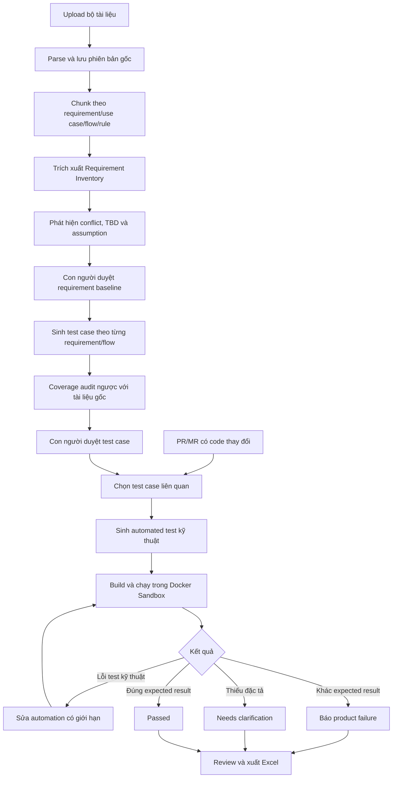

# AI Test Assistant – Cơ chế hoạt động hiện tại và định hướng mới

> **Trạng thái tài liệu – 11/09/2026:** Phase 0–5 của kiến trúc
> **document-driven test generation + code execution** đã được triển khai song
> song với pipeline PR/MR cũ. Hệ thống hiện nhận DOCX/Markdown, index semantic,
> trích xuất và duyệt requirement có evidence, sinh/duyệt test case nghiệp vụ và
> tính coverage từ database. XLSX/export và nối baseline này vào lần chạy PR/MR
> vẫn thuộc Phase 6 trở đi. Xem checklist tại
> [docs/DOCUMENT_DRIVEN_TESTING_REFACTOR_PLAN.md](docs/DOCUMENT_DRIVEN_TESTING_REFACTOR_PLAN.md).

## 1. Dự án sẽ dùng để làm gì?

AI Test Assistant hướng tới việc đọc tài liệu nghiệp vụ để xây dựng test case có
truy vết, sau đó dùng code tại đúng commit làm đối tượng thực thi kiểm thử.

Nguyên tắc cốt lõi:

```text
Tài liệu quyết định WHAT: cần kiểm thử gì và kết quả đúng là gì.
Code quyết định HOW: cần viết test kỹ thuật thế nào và chạy trên build nào.
```

Hệ thống không được đọc implementation rồi thay đổi expected result để khớp với
hành vi hiện tại của code. Nếu code chạy khác tài liệu đã được phê duyệt, kết quả
phải là `FAILED` hoặc `NEEDS_CLARIFICATION`, không phải sửa expected result.

## 2. Cần phân biệt phiên bản hiện tại và kiến trúc mục tiêu

| Nội dung | Code hiện tại | Kiến trúc mục tiêu |
| --- | --- | --- |
| Điểm bắt đầu | PR/MR webhook cũ vẫn hoạt động; document workflow bắt đầu từ upload | Upload tài liệu; PR/MR kích hoạt lần chạy ở Phase 7 |
| Nguồn test scenario | Document requirement inventory đã có; legacy pipeline vẫn dùng diff | Requirement, use case, business rule, acceptance criteria, lỗi cũ |
| Nguồn expected result | Phase 5 business test dùng approved evidence; legacy generated Go test vẫn tồn tại riêng | Chỉ từ bằng chứng tài liệu có truy vết |
| Vai trò của code | Vừa tạo context, vừa là đối tượng chạy test | Chỉ dùng để xác định phạm vi kỹ thuật, viết automation và thực thi |
| Đầu ra | Go generated test và sandbox result | Test case, coverage matrix, automated test, execution report và Excel |
| Trạng thái chuyển đổi | Được giữ tương thích | Phase 0–5 đã xong; Phase 6–11 chưa làm |

Frontend `Documents` hiện có các màn hình index, requirement inventory/review,
test-case review và coverage. Các màn hình Projects/Review cũ vẫn được giữ tương
thích trong khi các phase thực thi và export tiếp tục chuyển đổi.

## 3. Đầu vào của kiến trúc mục tiêu

### 3.1. Bộ tài liệu nghiệp vụ

Hệ thống nhận một hoặc nhiều tài liệu thuộc các nhóm:

- Software Requirements Specification/URD;
- user story và acceptance criteria;
- business rule và use case;
- tài liệu thiết kế hệ thống;
- tài liệu database/data dictionary;
- API contract;
- lịch sử lỗi để tạo regression test;
- bộ test cũ chỉ làm tài liệu tham khảo, không mặc nhiên là nguồn đúng.

Mỗi tài liệu phải có tên, phiên bản, loại, trạng thái phê duyệt và mức độ ưu tiên.
Tài liệu `APPROVED` được ưu tiên hơn `DRAFT`. Khi hai nguồn mâu thuẫn, hệ thống
phải báo conflict để con người xử lý thay vì tự chọn âm thầm.

### 3.2. Repository và thay đổi cần kiểm thử

GitHub/GitLab vẫn được sử dụng để cung cấp:

- repository và PR/MR;
- source/target commit;
- diff và file thay đổi;
- snapshot code dùng để build và chạy test.

Diff, changed symbol và impact graph chỉ hỗ trợ chọn phạm vi test/automation.
Chúng không phải bằng chứng cho expected behavior.

### 3.3. Cấu hình thực thi

Muốn tự động chạy test, hệ thống còn cần framework và môi trường phù hợp:

- Go package/interface đối với unit test;
- OpenAPI, base URL và credential thử nghiệm đối với API test;
- URL, locator và test account đối với UI test;
- dữ liệu seed/cleanup và các dependency cần thiết.

Nếu tài liệu không đủ để tạo test tự động đáng tin cậy, test case vẫn được lưu ở
trạng thái manual hoặc `BLOCKED`, không tự bịa thông tin kỹ thuật.

## 4. Các thành phần mục tiêu

| Thành phần | Vai trò |
| --- | --- |
| Frontend Next.js | Upload tài liệu, duyệt requirement/test case, theo dõi run và tải Excel |
| Go API | Nhận tài liệu, webhook, review decision và cung cấp báo cáo |
| Document parser | Đọc DOCX/Markdown; có thể bổ sung import XLSX; giữ heading, bảng và vị trí nguồn |
| Requirement worker | Trích xuất requirement, flow, rule, conflict và TBD |
| PostgreSQL + pgvector | Lưu phiên bản tài liệu, chunk, requirement, test case và evidence |
| Gemini/OpenAI | Chuẩn hóa yêu cầu, sinh test case và chuyển test case thành automation |
| GitHub/GitLab | Cung cấp commit/build cần kiểm thử và kích hoạt lần chạy |
| Docker Sandbox | Chạy automated test cô lập tại đúng source commit |
| Report exporter | Xuất Markdown/XLSX với Expected, Actual, P/F/NY và bằng chứng |

## 5. Luồng hoạt động mục tiêu



## 6. Cách RAG xử lý tài liệu

Không dùng top-k retrieval đơn lẻ rồi yêu cầu AI “sinh đủ test”, vì cách đó có
thể bỏ sót requirement không được truy xuất. Pipeline phải gồm hai tầng:

1. Quét toàn bộ tài liệu để tạo `Requirement Inventory` đầy đủ.
2. Với từng requirement/flow, RAG lấy các chunk liên quan rồi sinh test case.

Chunk phải bám cấu trúc nghiệp vụ, ví dụ:

- một requirement hoặc acceptance criterion;
- một business rule;
- một main/alternate/exception flow;
- một bước use case;
- một hàng trong bảng đặc tả;
- một lỗi cũ và điều kiện tái hiện.

Mỗi chunk phải giữ metadata nguồn: document, version, approval status, section,
requirement/use-case ID, flow type, step number và source locator.

## 7. Test case và automated test là hai đối tượng khác nhau

### Test case nghiệp vụ

Được sinh từ tài liệu và gồm:

- requirement trace;
- mục tiêu, loại test và mức rủi ro;
- actor, precondition và test data;
- các bước thực hiện;
- expected result và post-condition;
- trích dẫn nguồn, assumption/conflict/TBD và confidence;
- trạng thái Draft/Approved/Rejected.

### Automated test artifact

Là code/script dùng để thực thi một test case đã duyệt. AI có thể đọc thông tin
kỹ thuật tối thiểu của repository để viết automation có thể compile, nhưng không
được thay đổi scenario hoặc expected result đã được duyệt.

Một test case có thể chưa có automation. Khi đó hệ thống phải hiển thị rõ
`MANUAL`, `AUTOMATABLE`, `AUTOMATED` hoặc `BLOCKED`.

## 8. Coverage phải được kiểm tra như thế nào?

Hệ thống phải tính coverage từ các liên kết đã lưu, không lấy lời khẳng định của
LLM làm bằng chứng. Tối thiểu cần có:

- requirement coverage;
- main/alternate/exception-flow coverage;
- positive/negative/boundary coverage;
- role/permission coverage;
- state-transition coverage;
- integration/error coverage;
- NFR coverage khi tài liệu có tiêu chí đo được.

Không được tuyên bố “100% coverage” nếu chỉ phủ bản tóm tắt do AI tự tạo mà bỏ
qua nhánh trong tài liệu gốc.

## 9. Quy tắc đánh giá kết quả chạy

| Tình huống | Kết quả |
| --- | --- |
| Actual khớp expected từ tài liệu | `PASSED` |
| Product chạy khác expected đã duyệt | `FAILED` |
| Automation sai import/package/fixture/locator | `AUTOMATION_ERROR`, có thể repair |
| Môi trường hoặc dependency hỏng | `INFRA_ERROR`, retry có giới hạn |
| Tài liệu thiếu hoặc mâu thuẫn | `NEEDS_CLARIFICATION` |
| Chưa chạy | `NOT_RUN`/`NY` |

Repair chỉ được sửa phần triển khai automation. Nó không được đổi expected result
để biến product failure thành test pass.

## 10. Báo cáo và file Excel

File xuất cần hỗ trợ các cột giống template test management:

- Test Case ID và Requirement Trace;
- Test Objective, Preconditions, Steps và Test Data;
- Role, Expected Result và Priority;
- build/commit SHA và environment;
- Actual Result, `P/F/NY/BLOCKED`;
- log, ảnh chụp hoặc evidence link;
- ngày chạy, người/worker thực hiện và execution round;
- document/version/section làm nguồn.

`Generated by AI` và `Business source` phải là hai trường khác nhau. AI là tác
nhân tạo draft, không phải nguồn xác nhận nghiệp vụ.

## 11. Phần đang chạy trong repository

Document-driven pipeline hiện chạy tới Phase 5:

```text
DOCX/Markdown → parse blocks → semantic index → requirement inventory
→ source/requirement review → grounded test cases → coverage audit → test review
```

Khi không cấu hình LLM, môi trường local dùng extractor/generator deterministic
để kiểm thử luồng và tạo draft bảo thủ. Khi bật OpenAI/Gemini, output phải qua
strict schema và grounding guard trước khi lưu; trong cả hai chế độ chỉ
requirement có evidence từ document version đã duyệt mới được phê duyệt và đưa
vào sinh test.

Pipeline code-first cũ vẫn chạy song song:

```text
PR/MR webhook
→ lấy diff và code
→ changed-symbol/impact analysis
→ code/docs RAG
→ AI recommendation
→ sinh Go test
→ Docker validation
→ bounded repair
→ human review
```

Các phần legacy được giữ làm baseline để nối approved business test với PR/MR ở
Phase 7+, không được dùng để thay expected result của Phase 5. Export XLSX và
execution report vẫn chưa có trong document-driven workflow.

## 12. Cách trình bày ngắn với giảng viên

> Hệ thống lấy tài liệu yêu cầu làm nguồn xác định test scenario và expected
> result. RAG chia tài liệu theo requirement, use case, business rule và từng
> nhánh nghiệp vụ, sau đó AI sinh test case có trích dẫn nguồn và hệ thống kiểm
> tra ma trận coverage. Khi repository có Pull Request hoặc Merge Request, code
> mới chỉ đóng vai trò đối tượng được build và chạy kiểm thử. AI có thể dùng
> thông tin kỹ thuật để hiện thực test tự động, nhưng không được thay đổi kết quả
> mong đợi lấy từ tài liệu. Kết quả chạy, log và bằng chứng được review rồi xuất
> thành báo cáo Excel.
